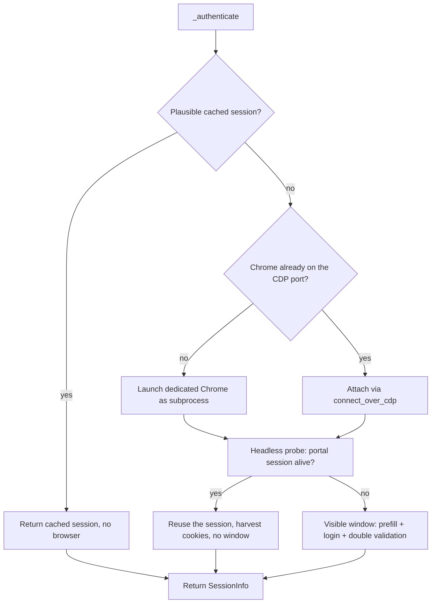
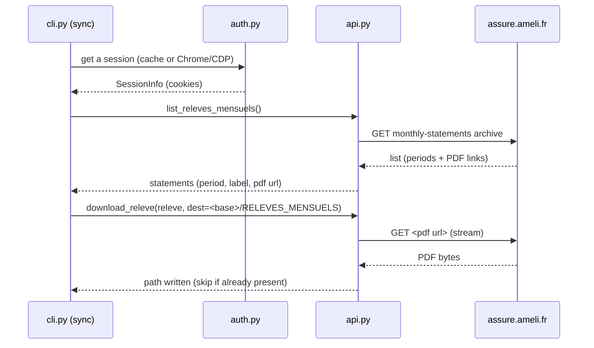

# ameli-cli — Technical Specification

This document describes **how** `ameli-cli` is built: architecture, module
responsibilities, data flows and the design decisions that matter when touching
the code. Read it together with:

- [docs/functional-specs.md](functional-specs.md) — the user-facing behavior;
- [docs/research.md](research.md) — the raw exploration notes (portal
  footprints, items to confirm);
- [docs/API.md](API.md) — the HTTP mapping of the portal, **to be established by
  capture** (this spec fixes the architecture, not yet the wire format).

> Status: the wire-level details (exact routes, JSON/HTML shapes, required
> cookies, session lifetime) are **to be confirmed by capture** during a real,
> logged-in session. Items marked "to confirm" will be frozen in `docs/API.md`
> and then in the code.
>
> **Update (2026-09-09):** the live capture is done and the tool works end to
> end against the real archive (see `docs/API.md` for the mapping and
> `docs/AUTH.md` for the authentication). Two design points changed: (1) the
> transport is a **visible dedicated Chrome** — the WAF rejects plain HTTP and
> headless browsers; (2) the REST calls run as **same-origin `fetch` from the
> archive page** with the SPA headers (`canal`, `x-app-*`, …), not through a
> `requests` session.

## 1. Tech stack & packaging

| Item | Choice |
| --- | --- |
| Language | Python ≥ 3.14 (`requires-python = ">=3.14"`, `.python-version` = `3.14`) |
| CLI | `argparse` subcommands, then validated with **pydantic v2** (`schemas.py`) |
| Config | **TOML** (`tomllib` stdlib), validated with pydantic |
| HTTP | `requests` (CDP health probes, session-authenticated portal calls) |
| Browser | `playwright` — **attach over CDP only** (never used to *launch* the login Chrome) |
| Project/env | **uv (Astral)** — `uv init`, `uv add`, `uv sync`, `uv run`, `uv lock` |
| Data validation | pydantic v2 (`BaseModel`, `extra="forbid"` for the config) |
| Build | backend `uv_build`; entry point `ameli-cli = ameli_cli.cli:main` (`pyproject.toml`) |
| Lint/type | `ruff` (line-length 100) |

## 2. Repository & module layout

```text
src/ameli_cli/
├── __init__.py        # empty (package marker)
├── __main__.py        # python -m ameli_cli → cli.main()
├── cli.py             # subcommands, bootstrap, orchestration, exit codes
├── config.py          # TOML loading/validation → Config dataclass
├── schemas.py         # pydantic models (TOML + CLI) — the trusted boundary
├── paths.py           # XDG path resolution
├── auth.py            # browser authentication + session cache
├── api.py             # ameli portal HTTP client (listing + downloads)
└── assets/
    └── config.toml    # shipped template (importlib.resources)
```

### Module responsibilities

| Module | Responsibility |
| --- | --- |
| `cli.py` | Parses args, validates them (`CliOptions`), bootstraps config/logging/paths, runs each subcommand, maps errors to exit codes. |
| `config.py` | Resolves the config path, writes the template if missing, parses/validates the TOML (`tomllib` + `ConfigFile`), returns an effective `Config` dataclass with defaults already resolved. |
| `schemas.py` | Central validation of every external value (config sections `AuthFile`, `ApiFile`, `LogFile`, `PathsFile`, `ConfigFile`; CLI `CliOptions`). `extra="forbid"` rejects unknown keys. |
| `paths.py` | Pure XDG resolution (data/state/cache homes, `~/Documents`); no application state in the source tree. |
| `auth.py` | Session cache (load/save), launch/attach of the dedicated Chrome (CDP), session (cookie) harvesting after login. |
| `api.py` | Portal client: list of the monthly statements of the archive, PDF download, file-name sanitization. |

## 3. Configuration subsystem

**Precedence:** CLI option → TOML config file → built-in default.

```text
CLI (argparse) → CliOptions (pydantic)   ──┐
                                            ├─► effective Config (config.py)
config.toml   → ConfigFile (pydantic)      ─┘        │
                                                      ▼
                              XDG defaults filled in when a [paths] key is empty
```

- `tomllib.loads` parses the file; a `TOMLDecodeError`/`OSError` raises
  `ConfigurationError` (→ exit code 2).
- The template (`assets/config.toml`) is read via `importlib.resources` so it
  ships inside the wheel; every key is commented out, documenting its default.
- Config-file path: `~/.config/ameli-cli/config.toml`, overridable with
  `--config`. `_resolve_path` applies `Path.expanduser()`.
- `command:` secrets (`_resolve_secret` in `cli.py`) are executed through
  `$SHELL -c` **non-interactively** (20 s timeout); their stdout (minus the
  trailing newline) is the value. Failure → warning + empty value.
- `Config` is a plain `@dataclass` with built-in defaults: `login_url`,
  `login`, `password`, `headless`; `api_base_url`,
  `releves_url = "https://assure.ameli.fr/compte/aspm/releves-mensuels"`,
  `collections` default `["RELEVES_MENSUELS"]`; `log_level`; resolved paths
  (`download_dir`, `chrome_dir`, `session_cache`).

> No `[playwright]` section and no browser channel: authentication **always**
> goes through the dedicated Chrome launched as a subprocess (own profile +
> DevTools), then attached over CDP — there is no legacy "Playwright profile"
> path to preserve.

## 4. Path resolution (`paths.py`)

- `xdg_data_home()` → `$XDG_DATA_HOME` or `~/.local/share`
- `xdg_state_home()` → `$XDG_STATE_HOME` or `~/.local/state`
- `xdg_cache_home()` → `$XDG_CACHE_HOME` or `~/.cache`
- `documents_dir()` → `~/Documents`; `download_dir()` → `~/Documents/ameli`
- `chrome_dir()` → `~/.local/state/ameli-cli/chrome`
  *(dedicated login Chrome profile, `--user-data-dir`: the portal session
  persists there between runs)*
- `session_cache_path()` → `~/.local/state/ameli-cli/session.json`

## 5. Authentication subsystem (`auth.py`)

### 5.1 Session model and cache

- `SessionInfo` = portal session cookies (list of cookie dicts) + `obtained_at`
  (unix seconds).
- The cache JSON (`{cookies, obtained_at}`) is read by `load_session_cache`
  (returns `None` when absent/malformed or older than the TTL, with a safety
  margin `_SAFETY_MARGIN`) and written by `save_session_cache`.
- **Validity policy**: the real lifetime of a portal session is **to be
  measured**; by default the CLI self-assigns a conservative TTL
  (`_SESSION_TTL`) from the moment the session was obtained. The **headless
  probe** remains the arbiter: it checks at each run that the session is really
  alive (see 5.2), so a "stale" cache only costs one probe.

### 5.2 Authentication flow

A single flow exists — the **dedicated Chrome + CDP** (default and only):



**Dedicated Chrome / CDP**:

1. Locate a Chromium binary (`_find_chrome_binary`): `google-chrome-stable`,
   `google-chrome`, `chromium`, …
2. If a Chrome already answers on `http://127.0.0.1:9222` (`_cdp_reachable`,
   GET `/json/version`) → plain **attach** (`connect_over_cdp`), leave it
   running.
3. Else launch a **headless** dedicated Chrome as a plain subprocess
   (`_launch_chrome_debug`: `--remote-debugging-port`, `--user-data-dir`,
   `--headless=new`, **no URL on the command line**) and run a short probe: if
   the portal session is alive, harvest the cookies with no window; the probe
   **fast-fails** as soon as a login form appears (`_login_form_visible`).
4. Wait for the probe's Chrome to release the profile/port (`_wait_cdp_gone` —
   Chrome is single-instance per `--user-data-dir`), then launch a **visible**
   window: login and password are auto-filled (best effort, see 5.3), the
   user **completes the double validation** (SMS / app), then the Chrome is
   closed (`_terminate_chrome`) — the session stays on disk.

Attaching (`_login_over_cdp`): navigate only via `ctx.new_page().goto()`;
`_pick_session_context` picks the context holding the ameli session (cookie for
`assure.ameli.fr`). Cookies are harvested from the authenticated context once
the logged-in page is reached.

### 5.3 Double validation & page handling

- The login form (J2EE portal, server-rendered HTML,
  `_pageLabel=as_login_page`) has stable selectors (captured 2026-09-09):
  `#userfield` (numéro de sécurité sociale, 13 digits), `#passwordfield`, the
  submit button `#id_r_cnx_btn_submit` (kept **disabled** by the page JS until
  both fields are valid) and the cookie-consent banner `#accepteCookie`.
- When configured, the CLI pre-fills those fields (`AmeliBrowser._try_prefill_login`)
  and submits the form; the **double validation** (SMS/app) that follows
  cannot be reliably automated → it always happens **in the visible window**.
- Credentials (`[auth] login`/`password`) are only **resolved** (a `command:`
  secret executed through `$SHELL -c`) when a login is actually needed, so a
  secret command is not run on every cached-session run.
- If the user logs in through **FranceConnect** (external identity provider),
  the CLI cannot pre-fill credentials: the login is fully manual in the visible
  window — documented behavior, identical to a login without configured
  credentials.
- Credentials pre-fill is **best effort**: if the fields cannot be filled or
  the submit button stays disabled, the CLI instructs the user to log in
  manually in the window and waits for the logged-in page.

## 6. HTTP client / API (`api.py`)

Targets the **personal account portal** `https://assure.ameli.fr` — no public
API exists to read one's own account; internal routes are **deduced from the
browser traffic** (tracked in `docs/API.md`).



Details:

- **Transport**: an HTTP client **authenticated by the portal session
  cookies**. The concrete transport may be (1) `requests` fed with the
  harvested cookies, or (2) Playwright's `APIRequestContext` bound to the
  authenticated browser context (`context.request`), which shares cookies and
  headers with the session — the most robust until cookie compatibility outside
  the browser is proven. The exposed interface stays the same:
  `get(url, stream=True) → response`. The choice will be frozen after capture.
- **Known entry point**: the monthly-statements archive
  (`/compte/aspm/releves-mensuels`), reached from the portal payment screen.
  The **exact shape** (HTML page to parse vs internal JSON) is **to confirm**:
  a tolerant extractor (`_extract_releves`) accepts the shapes encountered
  (list of month rows + download link, or a JSON document), mirroring defensive
  extraction. Debug/`--verbose` logs the raw payload so the shape can be
  inspected during the first real run.
- **Identification**: each statement is identified by its **period** (month,
  e.g. `2025-08`) — the stable id used for the file name and the incremental
  skip. Label + period + PDF URL are kept.
- **File names**: the on-disk name is rendered from the configurable
  `file_mask` (`api.py` `_render_mask`): `{period}`/`{year}`/`{month}`/`{label}`
  are substituted (default `Relevé Mensuel {period}.pdf`), then sanitized
  (illegal characters → `_`, collapsed whitespace) with the `.pdf` extension
  ensured. The mask is validated at config load (`schemas.py`).
- **Download**: stream to `<destination>/<file name>` (120 s timeout, 64 KiB
  chunks).
- HTTP 401 / rejected session → clear actionable message: `Run ameli-cli login`.

## 7. Orchestration (`cli.py`)

`sync` is the reference pipeline:

1. **Bootstrap** — `_bootstrap_config` (resolve/create/validate config, set up
   logging) then `_bootstrap_paths` (Chrome profile, session cache, download
   dir, headless).
2. **Step 1 — authentication** via `_authenticate` (see §5); abort with exit 1
   on failure.
3. **Step 2 — listing** via `api.list_releves_mensuels()` (the archive).
4. **Step 3 — download**: create the base dir **and the collection sub-folder**
   (even empty), then for each statement `dest = <base>/RELEVES_MENSUELS`:
   skip when `<dest>/<file_name>` (current `file_mask`) already exists
   (filename-only skip); else rename a legacy `nomAffichage`-named file to the
   current mask (`api.rename_legacy`); else download. Final report: downloaded
   vs renamed vs already present vs failed.

`list` (`ls`) prints `label\tperiod` per statement (or the raw JSON on stdout
with `--json`). `login` is idempotent (valid cache → message, no browser).
`logout` removes the session cache; `--reset` also `shutil.rmtree`s the Chrome
profile.

### Logging

- Human logs go to **stderr** (`_LOG_FORMAT`, timestamped), so `stdout` stays
  usable for `ls --json`.
- The `asyncio` logger is set to `CRITICAL` to silence Playwright's Node-driver
  transport noise.
- Exit codes: `0` success · `1` auth/backup failure · `2` invalid
  config/options (`ConfigurationError`, pydantic validation) · `130` Ctrl-C.

## 8. Security considerations

- The dedicated Chrome exposes its profile on `127.0.0.1:9222` (loopback only);
  it is a **dedicated, app-owned profile**, never the user's personal one.
- Session cookies are plain JSON under `~/.local/state` (readable by the local
  user only).
- `command:` secrets run non-interactively through `$SHELL -c`; they must be
  real executables (shell functions from startup files are not loaded).
- `logout --reset` is the only path that deletes the persisted browser
  sessions.

## 9. Known limitations & gotchas (design constraints)

- **No public API**: the integration relies on the internal portal, undocumented
  and subject to change — track the **portal version** (e.g. `25.29.00`, seen in
  the page footer) in `docs/API.md`.
- **Endpoints and formats to map**: v1 cannot be frozen until capture reveals
  the real list/download routes and the response shapes (HTML vs JSON) — hence
  a tolerant extractor.
- **Interactive double validation**: the first login (and any re-login after
  expiry) requires a visible window; `--headless` cannot log in.
- **Unknown session lifetime**: the cache TTL is self-assigned and calibrated
  after measurement; the headless probe arbitrates at each run.
- **Filename-only skip**: no local content index — a renamed or regenerated
  statement is re-downloaded/skipped by name only.
- **On-demand PDFs**: archive statements are probably generated on the fly by
  the portal; depending on capture, `sync` must trigger the generation then
  fetch the PDF (or store raw data if no PDF is offered).
- **Single-instance Chrome per `--user-data-dir`**: the headless probe must
  fully release the profile/port before a visible window can start.
